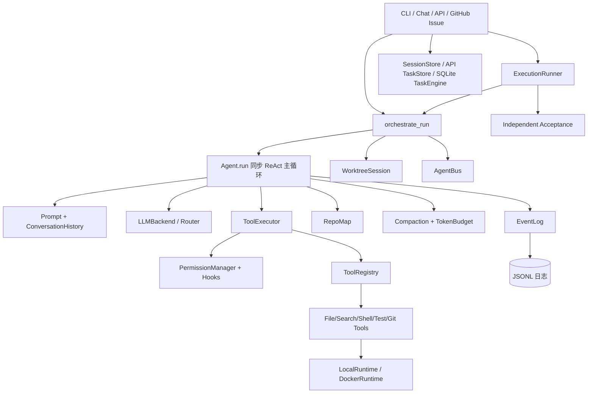

# Forge Agent 当前代码架构与结构关系

> 生成日期：2026-09-15
> 依据：当前工作树源码（不含 `tests/`）与现有运行配置。本文记录可从代码定位的事实，不把推测写成已实现能力。

## 1. 阅读范围与系统定位

Forge Agent 是一个以同步 `Agent.run()` 为核心的编码代理。它通过 LLM 后端产生动作，经过工具注册表、权限管理和运行时执行工具，再把观察结果写回会话历史；事件日志、任务状态、Repo Map 和 Token Budget 为运行提供审计、持久化和上下文控制。`asyncio` 主要出现在入口编排、事件总线和运行时适配层，不改变 Agent 内核的同步主循环定位。

本文件忽略 `tests/`，也不把测试夹具当作生产模块。`config/default.yaml` 只记录配置接口和默认分层，不复制任何密钥值。

## 2. 总体分层与依赖方向



依赖方向原则：入口负责组装依赖和生命周期；`agent` 负责任务循环与编排；`context` 负责上下文；`llm` 负责协议适配；`tools` 只负责具体动作；`harness` 负责工具执行前后的治理；`runtime` 负责进程/容器边界；`task`、`session`、`event_log` 负责状态与审计。生产代码没有把测试模块反向作为运行时依赖。

## 3. 关键运行链路

### 3.1 本地 CLI / Chat

1. `entry/cli.py` 读取 `config.schema.load_config()`，创建 LLM backend 与 `ToolRegistry`。
2. `entry/cli.py` 组装 `RunRequest`，交给 `agent.runner.ExecutionRunner`。
3. `ExecutionRunner` 调用 `agent.orchestrate.orchestrate_run()`，按配置选择本地或 Docker runtime、worktree 策略、权限管理器和事件日志。
4. `Agent.run()` 构造系统/任务消息，调用 backend；若返回工具动作，则由 `ToolExecutor` 执行并形成 `Observation`，继续下一轮。
5. 成功性由任务完成守卫、验收契约和 `RunResult` 表示；事件持续写入 `EventLog`。
6. `entry/chat.py` 在交互模式下消费事件、显示步骤与 Token 用量，并通过 `session_store` 保存会话。

### 3.2 HTTP API

`entry/api.py:create_app()` 注册 FastAPI 路由。请求先由 `ApiTaskStore` 持久化，再由后台线程调用 `run_agent_task()`；任务状态、取消标记、JSONL 日志和 SSE 事件流由 API 层汇总。仓库路径通过允许根目录检查，避免 API 任务越界访问。

### 3.3 GitHub Issue 自动 PR

`entry/github_issue.py:run_on_issue()` 获取 Issue、克隆目标仓库、创建分支并构建目标仓库绑定的 registry。自动 PR 模式会移除 Agent registry 中的 `git_add`/`git_commit`，由独立验收和交付层完成提交、push 与 PR；`--no-pr` 模式保留 Git 工具以维持本地兼容行为。GitHub Token 仅通过临时 Git extraHeader 传给子进程，不写入 URL、remote 或日志。

### 3.4 上下文刷新与压缩

`Agent` 维护当前 `RepoMap`、`ConversationHistory` 和 `TokenBudget`。文件写入/编辑成功后，当前 Run 的 Repo Map 摘要会失效，下一 step 重新构建消息时读取新状态。Token 超限时由 `context.compaction.TraceableCompaction` 生成带 checkpoint 的摘要并保留可追踪事件；这不是确定性重放机制。

## 4. 逐文件职责注释（不含测试）

表中“关键符号”用于源码定位；空的 `__init__.py` 仅承担包边界，不承载业务逻辑。

### 4.1 Agent 核心层

| 文件                       | 代码职责注释                                                                     | 关键符号 / 关系                                                                      |
| ------------------------ | -------------------------------------------------------------------------- | ------------------------------------------------------------------------------ |
| `agent/__init__.py`      | Agent 包标记文件。                                                               | 无运行逻辑。                                                                         |
| `agent/task.py`          | 定义任务、动作、工具调用、观察、事件和运行结果等领域数据模型与枚举。                                         | `Task`、`Action`、`Observation`、`Event`、`RunResult`；被 Agent、工具、日志和 runner 共享。    |
| `agent/core.py`          | 同步 ReAct 主循环；组装 prompt、调用 LLM、执行工具、完成性守卫、Reflection、循环检测、Repo Map 失效和错误分类。 | `Agent`、`AgentConfig`、`PrepareNextTurnContext`；依赖 context、llm、tools、event_log。 |
| `agent/prompt.py`        | 生成系统提示、任务提示、工具说明和反思提示。                                                     | `build_system_prompt()`、`build_task_prompt()`；输入为工具 schema 与任务信息。              |
| `agent/runner.py`        | 单次执行入口；封装 `RunRequest`、生命周期、独立验收、改动快照和结果归一化。                               | `ExecutionRunner`、`AcceptanceContract`；调用 `orchestrate_run()`。                 |
| `agent/orchestrate.py`   | 编排 Agent、ToolExecutor、runtime、worktree、权限、事件总线和任务引擎；负责最终化与清理。              | `orchestrate_run()`；是跨层生命周期连接点。                                                |
| `agent/event_log.py`     | 将任务事件、动作、观察、Token 用量和运行摘要写成 JSONL，并提供查询/汇总。                                | `EventLog`、`summarize_run()`；日志是审计记录，不是重放器。                                    |
| `agent/loop_detector.py` | 对动作、观察和仓库快照做规范化指纹，识别重复循环与严重度。                                              | `LoopDetector`、`snapshot_repository()`；被 `Agent` 调用。                           |
| `agent/session.py`       | 定义可持久化聊天会话、轮次、pending round 和版本化状态模型。                                      | `ChatSessionState`、`ChatRoundState`、`PendingRoundState`。                       |
| `agent/session_store.py` | 将会话状态原子写入 JSON 文件，校验仓库归属、版本和并发冲突，并过滤敏感内容。                                  | `JsonChatSessionStore`、`repo_key_for_path()`。                                  |

### 4.2 上下文层

| 文件                        | 代码职责注释                                           | 关键符号 / 关系                                      |
| ------------------------- | ------------------------------------------------ | ---------------------------------------------- |
| `context/__init__.py`     | Context 包标记文件。                                   | 无运行逻辑。                                         |
| `context/history.py`      | 管理 LLM 消息序列、追加和截取历史。                             | `ConversationHistory`；被 Agent 与 compaction 使用。 |
| `context/repo_map.py`     | 扫描仓库文件、提取符号/导入、计算引用与路径重要性，并支持 query-aware 摘要。    | `RepoMap`、`FileInfo`、`Symbol`；摘要被 prompt 消费。   |
| `context/token_budget.py` | 估算文本/消息 Token，规划历史保留与截断。可选使用 tiktoken，缺失时回退估算。   | `TokenBudget`、`BudgetPlan`。                    |
| `context/compaction.py`   | 在上下文压缩时记录仓库 revision、checkpoint、摘要和事件，提供可追踪压缩结果。 | `TraceableCompaction`、`CompactionCheckpoint`。  |

### 4.3 LLM 协议层

| 文件                         | 代码职责注释                                                          | 关键符号 / 关系                                                 |
| -------------------------- | --------------------------------------------------------------- | --------------------------------------------------------- |
| `llm/__init__.py`          | LLM 包标记文件。                                                      | 无运行逻辑。                                                    |
| `llm/base.py`              | 定义消息、工具 schema、响应、backend 抽象、Mock backend 和流式混入。                | `LLMBackend`、`LLMMessage`、`LLMResponse`、`StreamingMixin`。 |
| `llm/router.py`            | 根据配置选择 Anthropic、OpenAI-compatible 或 OpenAI Responses backend。  | `create_backend()`、`create_backend_from_config()`。        |
| `llm/errors.py`            | 将异常归类为认证、限流、超时、网络、协议或未知错误，并解析 retry-after。                      | `LLMErrorKind`、`classify_llm_error()`。                    |
| `llm/anthropic_backend.py` | Anthropic Messages 协议适配、工具调用解析、用量统计和流式文本桥接。                     | `AnthropicBackend`。                                       |
| `llm/openai_compat.py`     | OpenAI Chat Completions 兼容协议适配；解析原生工具调用、伪工具文本、finish/放弃文本和流式响应。 | `OpenAICompatBackend`。                                    |
| `llm/openai_responses.py`  | OpenAI Responses 协议适配；处理 reasoning、function call、usage 与流式回退。   | `OpenAIResponsesBackend`。                                 |
| `llm/usage.py`             | 定义单次请求和会话级 Token 用量，并提供序列化。                                     | `TokenUsage`、`SessionUsage`。                              |

### 4.4 工具与执行治理层

| 文件                         | 代码职责注释                                                     | 关键符号 / 关系                                                    |
| -------------------------- | ---------------------------------------------------------- | ------------------------------------------------------------ |
| `tools/__init__.py`        | Tools 包标记文件。                                               | 无运行逻辑。                                                       |
| `tools/base.py`            | 工具抽象、参数 schema 校验、结果/错误类型、注册表以及测试用 Noop/Failing 工具。        | `BaseTool`、`ToolRegistry`、`ToolResult`。                      |
| `tools/file_tool.py`       | 在 workspace 边界内读文件、查看窗口、写文件；负责路径解析和大小/行数限制。                | `FileReadTool`、`FileViewTool`、`FileWriteTool`。               |
| `tools/search_tool.py`     | 文本搜索、文件发现和符号发现；限制结果数量与单行长度。                                | `SearchTextTool`、`FindFilesTool`、`FindSymbolTool`。           |
| `tools/shell_tool.py`      | 执行 shell 命令，检查阻断模式、只读命令、确认策略和输出截断。                         | `ShellTool`、`terminal_confirm()`。                            |
| `tools/test_tool.py`       | 通过 runtime 执行 pytest，设置测试超时并格式化输出。                         | `PytestTool`。                                                |
| `tools/git_tool.py`        | 提供 status/diff/add/commit 工具，限制 diff 输出并通过 runtime 执行 Git。 | `GitStatusTool`、`GitDiffTool`、`GitAddTool`、`GitCommitTool`。  |
| `tools/runtime.py`         | 定义进程运行时抽象、本地 runtime、Docker runtime、容器参数和资源边界。             | `Runtime`、`LocalRuntime`、`DockerRuntime`、`create_runtime()`。 |
| `tools/sandbox.Dockerfile` | 构建 Docker 沙箱镜像的基础定义。                                       | 被 `DockerRuntime` 使用。                                        |
| `harness/__init__.py`      | 导出工具执行、权限和 Hook 组件。                                        | 包装层导出。                                                       |
| `harness/executor.py`      | 统一工具调用流程：参数校验、权限决策、Hook、runtime 执行、错误分类和观察结果生成。            | `ToolExecutor`。                                              |
| `harness/permission.py`    | 按工具与路径判定 allow/deny/confirm，防止 workspace 越界。               | `PermissionManager`、`PermissionDecision`。                    |
| `harness/hooks.py`         | 定义工具执行前后 Hook 事件、回调和阻断结果。                                  | `Hooks`、`HookEvent`。                                         |

### 4.5 运行隔离、任务与通信

| 文件                    | 代码职责注释                                 | 关键符号 / 关系                                                    |
| --------------------- | -------------------------------------- | ------------------------------------------------------------ |
| `runtime/__init__.py` | 导出 worktree 相关类型。                      | 包边界导出。                                                       |
| `runtime/worktree.py` | 管理隔离 worktree 的创建、变更检测、保留/丢弃策略和最终化产物。  | `WorktreeSession`、`WorktreeArtifact`、`WorktreeResultPolicy`。 |
| `task/__init__.py`    | 导出 SQLite 任务引擎和状态常量。                   | 包边界导出。                                                       |
| `task/engine.py`      | SQLite WAL 任务队列；实现条件认领、完成/失败状态迁移和并发保护。 | `TaskEngine`、`Task`、`STATUS_*`。                              |
| `ipc/__init__.py`     | 导出进程内 AgentBus 类型。                     | 包边界导出。                                                       |
| `ipc/bus.py`          | 异步 topic 总线，支持订阅、通配匹配、发布和取消。           | `AgentBus`、`Message`；由编排层转发运行事件。                             |

### 4.6 入口与持久化

| 文件                      | 代码职责注释                                                                      | 关键符号 / 关系                                                 |
| ----------------------- | --------------------------------------------------------------------------- | --------------------------------------------------------- |
| `entry/cli.py`          | Click CLI；加载配置、构建 registry、启动 run/chat/log 子命令并渲染结果。                        | `_build_registry()`、`run()`、`chat()`、`log_*()`。           |
| `entry/chat.py`         | 交互式 Chat UI；显示事件、颜色化状态、读取 revision 和调用会话。                                   | `ChatSession`、`_print_event_live()`。                      |
| `entry/api.py`          | FastAPI 服务、任务创建/取消/查询、SSE 事件流和 dashboard。                                   | `create_app()`、`run_agent_task()`。                        |
| `entry/api_store.py`    | API 任务的 SQLite 持久化、状态迁移和取消请求。                                               | `ApiTaskStore`、`ApiTask`。                                 |
| `entry/github_issue.py` | GitHub Issue → 本地运行 → 独立验收 → commit/push/PR 的交付入口；含安全 clone 和 `--no-pr` 分支。 | `run_on_issue()`、`clone_repo()`、`deliver_pull_request()`。 |

### 4.7 配置、评测与示例

| 文件                                  | 代码职责注释                                                   | 关键符号 / 关系                                            |
| ----------------------------------- | -------------------------------------------------------- | ---------------------------------------------------- |
| `config/schema.py`                  | 读取 YAML、展开 `${ENV_VAR}`、构造 dataclass 配置并合并 CLI 覆盖。       | `AppConfig`、`load_config()`、`merge_cli_overrides()`。 |
| `config/default.yaml`               | 默认 LLM、Agent、工具、上下文和 runtime 配置；敏感值通过环境变量引用。             | 运行时配置输入，保持用户文件不改。                                    |
| `evals/__init__.py`                 | 导出评测 harness API。                                        | 包边界导出。                                               |
| `evals/harness.py`                  | 从任务清单加载 EvalCase，物化临时仓库，执行 verifier 并汇总结果。               | `EvalCase`、`EvalResult`、`load_cases()`。              |
| `evals/run.py`                      | 驱动多 case 执行，调用 `ExecutionRunner`，记录 patch、工具调用数和结果 JSON。 | `EvalRunner`。                                        |
| `evals/report.py`                   | 读取评测 JSON，按 case/指标生成汇总报告。                               | `build_report()`。                                    |
| `evals/pr_test_issue_4_verifier.py` | 面向 `Napabana/pr-test` Issue #4 的仓库外验收脚本；运行目标测试并检查关键行为。   | 独立 verifier，不是 Agent 生产依赖。                           |
| `evals/fixtures/tasks.json`         | 固定评测任务清单。                                                | 被 `evals.harness` 读取。                                |
| `scripts/start.sh`                  | WSL/Linux 启动辅助脚本，设置仓库、虚拟环境和环境文件。                         | shell 启动入口。                                          |
| `scripts/m1_demo.py`                | 演示 worktree 与任务引擎协作的本地脚本。                                | 仅示例用途。                                               |
| `scripts/m4_demo.py`                | 演示事件总线、Agent、工具和任务引擎的组合流程。                               | 仅示例用途。                                               |
| `pyproject.toml`                    | 包元数据、依赖、入口点、pytest 和 coverage 配置。                        | `coding-agent` console script 指向 `entry.cli:main`。   |
| `smoke_test.py`                     | 根目录冒烟示例，验证基础运行链路。                                        | 非核心生产模块。                                             |
| `linked_list.py`                    | 教学/算法示例。                                                 | 与 Agent 运行时无依赖关系。                                    |
| `quicksort.py`                      | 教学/算法示例。                                                 | 与 Agent 运行时无依赖关系。                                    |

## 5. 状态与边界关系

| 状态对象                          | 所有者                            | 持久化/传播            | 重要边界                          |
| ----------------------------- | ------------------------------ | ----------------- | ----------------------------- |
| `Task` / `RunResult`          | `agent.task`、`ExecutionRunner` | 内存，结果写入事件日志/调用方   | 不等于 Git commit 或 PR 合并。       |
| `ConversationHistory`         | `Agent`                        | 会话 checkpoint 可落盘 | 压缩后只保留摘要和可追踪 checkpoint。      |
| `RepoMap`                     | 单个 `Agent.run()`               | 内存缓存              | 写工具成功后失效，下一 step 刷新；当前不做增量索引。 |
| `WorktreeSession`             | `orchestrate_run`              | 文件系统 Git worktree | `keep` 只表示保留变更，不代表已提交、推送或合并。  |
| `EventLog`                    | Agent/编排层                      | JSONL             | 审计记录，不是确定性重放。                 |
| `TaskEngine` / `ApiTaskStore` | 任务/API 入口                      | SQLite WAL        | 两者是不同用途的状态存储，不应混为一个状态机。       |

## 6. 大设计或大改动的合理性门禁

今后涉及跨层、大范围或改变交付语义的设计，先写出以下判断再编码：

1. **问题证据**：指出当前实现、真实日志、失败案例或可复现实验；没有证据的性能/可靠性收益只能写成假设。
2. **边界与影响面**：列出入口、Agent、工具、runtime、持久化、日志和兼容模式受影响的文件。
3. **最小替代方案**：先评估是否能通过局部修复、现有抽象或配置解决；没有必要不引入新依赖、MCP、多 Agent、向量索引或 speculative abstraction。
4. **状态与回滚**：说明幂等、并发、失败恢复、数据兼容、worktree/commit/PR 责任边界，以及如何撤销。
5. **验证计划**：先定义最小定向测试或真实评测、对照组、输入任务、重复次数和原始输出目录；没有测量就不写收益结论。
6. **用户确认门**：代码修改前列出拟修改文件及逐文件理由，等待确认；只读审计和文档更新可以先做。

建议评审记录格式：

```text
问题证据：
拟议设计：
受影响文件：
保留的现有契约：
最小替代方案及未采用原因：
失败/回滚路径：
定向验证：
等待确认项：
```

## 7. 当前未宣称事项

* 没有基于当前固定任务声称 Agent 真实成功率、Recall@K、MRR、延迟或成本收益。
* 没有把保留 worktree、生成 checkpoint、创建 commit、push、创建 PR、合并 PR 视为同一个动作。
* 没有把 EventLog 当作完整重放系统。
* Repo Map 的真实消融、Context Compaction 的端到端收益仍需先冻结实验协议，再决定是否改代码。
